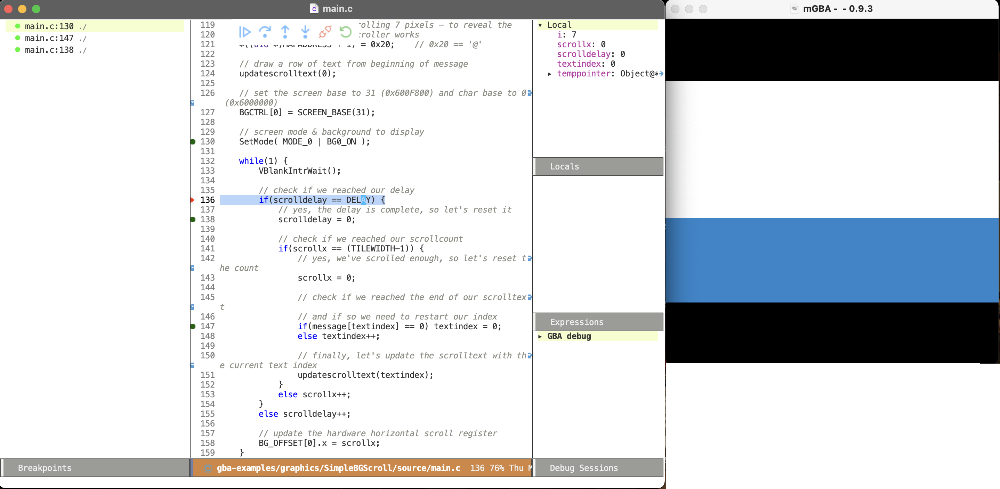

# gba-debug.el
Slightly opinionated debug-helper for debugging GameBoy Advance (GBA) programs/games in Emacs. With it, you don't need to do much manual work at all. No launch.json files, no manual compilation, no manual execution of mGBA etc. It does all of these for you :) (with the help of amazing packages like [dap-mode](https://github.com/emacs-lsp/dap-mode)). Just run `M-x gba-debug-program` in your code, and you are debugging! This is how it looks after it has started with a breakpoint (using SimpleBGScroll example from gba-examples in DevkitPRO):

## Dependencies
To use gba-debug.el, you need a few programs installed. These are probably pretty standard in most GBA developers arsenal. 
- make: used to run the compilations.
- [DevkitARM gba-dev](https://devkitpro.org/wiki/Getting_Started): Used to compile, and connect to mGBAs gdb interface.
- [mGBA](https://mgba.io/): Used to emulate the resulting .gba-file/executable.

For Emacs-related dependencies, you should set up `dap-gdb-lldb`, which [is described here](https://emacs-lsp.github.io/dap-mode/page/configuration/#native-debug-gdblldb). If the setup method does not work, you can download the extension directly and unzip the vsix-file (yes, it can be unzipped directly). 

## Assumptions
This extension assumes one thing: that you can build using make, and that the command produces an elf-file and gba-file in the same directory. It should also add debug symbols to the elf-file, which is done with the `-g` in the gcc-compiler (and similar for g++ and probably the assembler).

## Usage
You should set two variables:
- `gba-debug-gdb-path`: This is the complete path, including the executable, to DevkitARMs gdb. Standard path on Unix-based systems is the default: `/opt/devkitpro/devkitARM/bin/arm-none-eabi-gdb`.
- `gba-debug-mgba-path`: This is the complete path, including the executable, to mGBA. Example on Mac OS X (Homebrew install): `/Applications/mGBA.app/Contents/MacOS/mGBA`

After these variables are configured, you should be able to run `M-x gba-debug-program` from any source file in your GBA project :)
